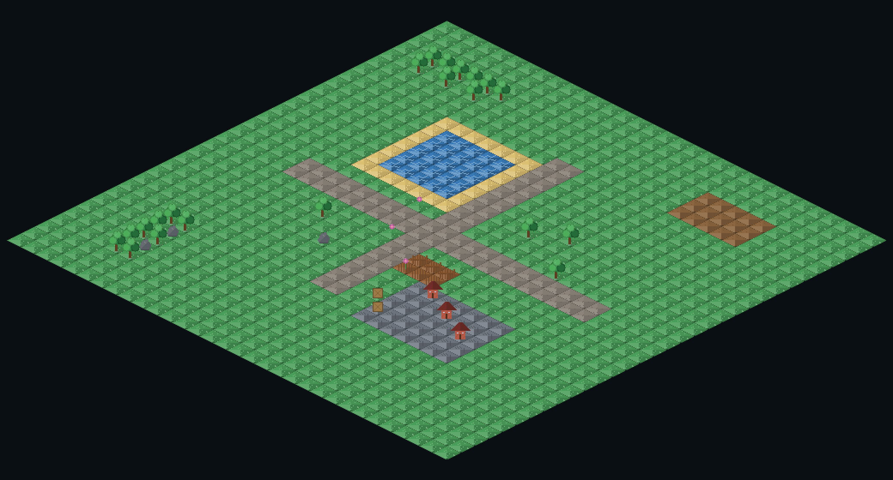

# Isometric Pixel Map

**Free browser tool** to paint retro **isometric pixel maps** — no install, no account.

[](https://zo.pub/triangle/isometric-pixel-map)
[](LICENSE)
[](https://godotengine.org)

**Play now → [zo.pub/triangle/isometric-pixel-map](https://zo.pub/triangle/isometric-pixel-map)**



## What is this?

Open a link, paint a mini isometric world (grass, water, houses, trees…), then export **PNG** (share) or **JSON** (reload later).

Built for game jams, mockups, pixel-art fun, and quick “show my map” posts.

## Features

- 32×32 classic 2:1 isometric grid
- Ground + props layers
- Pen / erase / fill / undo / redo
- Built-in pixel palette (runtime atlas)
- **6 job-driven starters** (blank, settlement, wilderness, crossroads, coast, stronghold)
- Export PNG + Save/Load JSON
- Touch: 1-finger paint, 2-finger pan + pinch
- Grid toggle, zoom +/−, Space+drag pan
- Free, MIT licensed

## Controls

| Action | Desktop | Touch |
|--------|---------|--------|
| Paint | Left drag | 1 finger |
| Pan | Right/middle drag or Space+drag | 2 fingers |
| Zoom | Scroll or `+` / `−` | Pinch |
| Undo / Redo | Ctrl+Z / Ctrl+Y | Buttons |
| Tools | P / E / F | Buttons |
| Grid | G | Grid button |

## Run locally (Godot)

Requirements: **Godot 4.6+**

```bash
godot --path .
```

### Verify

```bash
bash scripts/tools/verify.sh
```

### Web export

```bash
bash scripts/tools/export_web.sh
python3 scripts/tools/serve_web.py 8770
# open http://127.0.0.1:8770/
```

## Project layout

```
scenes/          Main + Editor
scripts/model/   MapData, Palette, TileAtlas
scripts/view/    Iso grid draw + input
scripts/ui/      Editor shell, palette bar, theme
scripts/export/  PNG + WebBridge
scripts/tools/   verify, export_web, serve_web
docs/            ROADMAP, DECISIONS, SHOW_HN
```

## Stack

- Godot 4.6 · GDScript · `gl_compatibility` Web export
- Static host (no backend)

## Contributing

PRs welcome — keep scope tight (tool-first, no accounts/cloud in MVP path).

```bash
bash scripts/tools/verify.sh   # must pass
```

## Related

- **[NapkinPlan](https://github.com/ZoriaSoft/napkin-plan)** — stamp a room layout in 60 seconds (Canvas floor sketch)  
  Live: https://zo.pub/triangle/napkin-plan/index.html

## License

[MIT](LICENSE) — free to use, modify, and ship.

Godot Engine has its own license; see [godotengine.org/license](https://godotengine.org/license).

